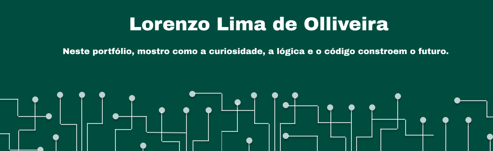

### **Olá pessoal! 👋 Sou o Lorenzo Lima, um estudante da Tecnologia da Informação**

***

🚀 Desde de muito novo sempre fui apaixonado por tecnologia, e agora estou dando sentido a essa paixão, a patir da programação. No ano de 2024, participei de um processo seletivo para entrar na Germinare TECH, uma escola referência no ramo de TI aqui em São Paulo, e com muito esforço eu consegui! Hoje, faço meu máximo para melhorar profissionalmente na área, além de melhorar pessoalmente.

🖥️ Meu kit de ferramentas tecnológicas inclui Java, Python, R, HTML e CSS, Postgresql e Shell Script. Minha paixão é Banco de Dados e Inteligência Artificial.

🧠 Quando se trata de resolução de problemas, minha mentalidade ágil se destaca, adaptando-se perfeitamente a diversas metodologias. Minha habilidade para desmembrar questões técnicas complexas em explicações claras e de fácil compreensão me permite conectar tecnologia e negócios sem esforço.

Vamos nos conectar e construir um futuro juntos! 🌟

    
  
  

### **Top Skills**

  
  
  
  
  
  
  
  
  
  
  
  

### **Visite o meu blog**

<a href="https://medium.com/@lorenzolimadeoliveira2010">Blog - Medium</a>

#### O blog foi feito com o objetivo de compatilhar conhecimentos e estudos sobre a área de TI. O foco é postar conteúdos teóricos sobre a tecnologia da informação que estou aprendendo na escola e por fora.

### **Estatísticas**

  
  

